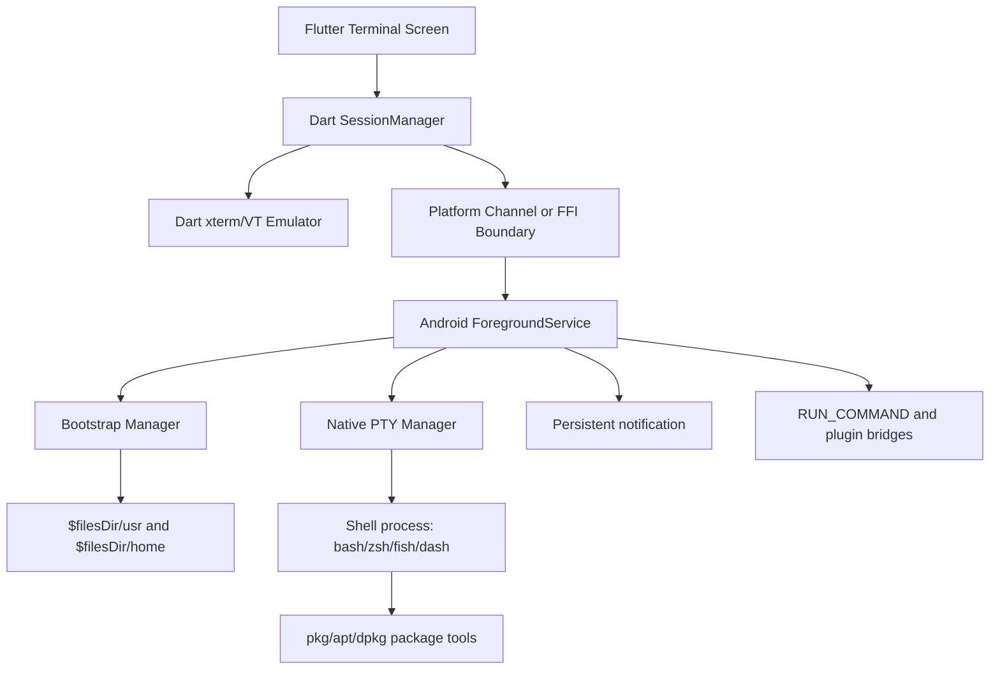
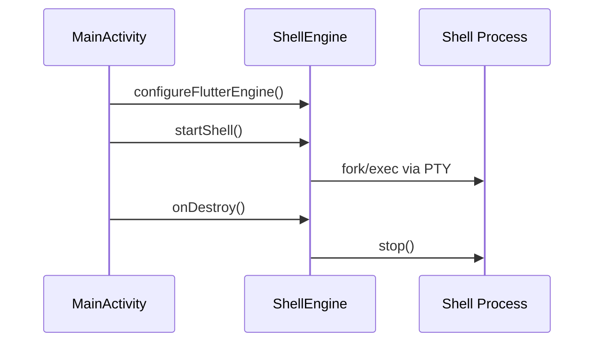
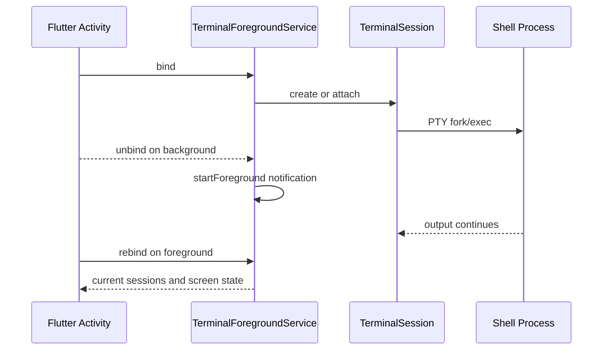

# termux_flutter Architecture

This document maps the current `termux_flutter` implementation against the bundled upstream `termux-app/` source tree. It is a migration architecture, not a claim of feature parity. The current app is a Flutter terminal surface with a custom Android PTY bridge and an early bootstrap loader; upstream Termux is a mature Android service, terminal emulator, package environment, and plugin platform.

## Source Baseline

Current Flutter implementation:

- `lib/main.dart` creates `TermuxFlutterApp`, owns one `TerminalController`, and renders one `TerminalWidget`.
- `lib/platform/shell_bridge.dart` exposes `MethodChannel('com.termux.flutter/shell')` and `EventChannel('com.termux.flutter/output')`.
- `lib/core/terminal/terminal_emulator.dart` parses PTY bytes into a renderer-neutral VT100/xterm screen model.
- `lib/core/terminal/screen_model.dart`, `screen_cell.dart`, `text_attributes.dart`, and `color_attribute.dart` store terminal cells, attributes, cursor, scroll margins, scrollback, and alternate screen state without Flutter dependencies.
- `lib/core/terminal/wc_width.dart` provides Unicode width behavior for ASCII, combining marks, CJK, and emoji.
- `lib/terminal/terminal_emulator_adapter.dart` adapts the new core model into the existing Flutter `TerminalBuffer` painter bridge until the Phase 3 renderer replaces it.
- `lib/terminal/ansi_parser.dart` remains as a legacy reference but is no longer on the live terminal output path.
- `lib/terminal/terminal_buffer.dart` stores simple lines/cells for the current painter adapter.
- `lib/terminal/terminal_widget.dart` renders with `CustomPainter`, uses a hidden `EditableText` for Android IME, and forwards input to the controller.
- `android/app/src/main/java/com/termux/flutter/MainActivity.java` registers the platform channels and a legacy Android mouse-cursor workaround.
- `android/app/src/main/java/com/termux/flutter/ShellEngine.java` starts the process through `BootstrapInstaller`, `PtyProcess`, and pipe fallback.
- `android/app/src/main/java/com/termux/flutter/BootstrapInstaller.java` expects ABI-specific bootstrap archives under `android/app/src/main/assets/bootstrap/`.
- `android/app/src/main/cpp/pty_bridge.c` creates a PTY, forks, applies `TIOCSCTTY`, sets window size, and `execve()`s the requested shell.

Upstream Termux source of truth:

- `termux-app/terminal-emulator/src/main/java/com/termux/terminal/TerminalSession.java` owns PTY fd, subprocess lifecycle, read/write queues, and `TerminalEmulator`.
- `termux-app/terminal-emulator/src/main/java/com/termux/terminal/TerminalEmulator.java` implements xterm/vt100 parsing, OSC/APC/DCS/CSI state, title, colors, mouse tracking, alternate buffer, scroll regions, and resize.
- `termux-app/terminal-emulator/src/main/java/com/termux/terminal/KeyHandler.java` maps Android keys and modifiers into xterm control sequences.
- `termux-app/terminal-emulator/src/main/jni/termux.c` opens `/dev/ptmx`, configures UTF-8/flow-control termios, forks, clears fd table, sets env, chdirs, and execs.
- `termux-app/terminal-view/src/main/java/com/termux/view/TerminalView.java` handles rendering input, IME, gestures, mouse tracking, selection, scale, and scroll.
- `termux-app/terminal-view/src/main/java/com/termux/view/TerminalRenderer.java` paints rows using `TerminalRow`, `TerminalColors`, and `TextStyle`.
- `termux-app/app/src/main/java/com/termux/app/TermuxInstaller.java` extracts the embedded bootstrap zip, handles `SYMLINKS.txt`, chmods executables, stages `$PREFIX`, and writes shell environment.
- `termux-app/app/src/main/java/com/termux/app/TermuxService.java` owns persistent terminal sessions and notification lifecycle.
- `termux-app/termux-shared/src/main/java/com/termux/shared/termux/TermuxConstants.java` defines canonical app, prefix, home, plugin, and intent constants.
- `termux-app/termux-shared/src/main/java/com/termux/shared/termux/extrakeys/` defines extra key metadata and view behavior.

## System Diagram

```mermaid
flowchart TD
    U[User touch, IME, hardware keyboard] --> TW[lib/terminal/terminal_widget.dart]
    TW --> TC[lib/terminal/terminal_controller.dart]
    TC --> SB[lib/platform/shell_bridge.dart]
    SB --> MC[MethodChannel com.termux.flutter/shell]
    MC --> MA[MainActivity.java]
    MA --> SE[ShellEngine.java]
    SE --> BI[BootstrapInstaller.java]
    SE --> PP[PtyProcess.java]
    PP --> JNI[pty_bridge.c]
    JNI --> PTY[/dev/ptmx PTY pair]
    PTY --> SH[$filesDir/usr/bin/bash --login]
    SH --> PTY
    PTY --> JNI
    JNI --> PP
    PP --> EC[EventChannel com.termux.flutter/output]
    EC --> EMU[lib/core/terminal TerminalEmulator]
    EMU --> SMODEL[ScreenModel and ScreenCell grid]
    SMODEL --> ADAPT[terminal_emulator_adapter.dart]
    ADAPT --> TB[TerminalBuffer.dart]
    TB --> TP[CustomPainter in TerminalWidget]
```

Target Termux-equivalent architecture:



## Layer Breakdown

| Layer | Current implementation | Upstream reference | Required migration target |
| --- | --- | --- | --- |
| Flutter UI | Single `TerminalWidget` with `CustomPaint` and hidden `EditableText` | `TerminalView.java`, `TerminalRenderer.java` | Multi-session Flutter screen using a real terminal emulator widget or a faithful Dart port |
| Dart logic | `TerminalController`, `AnsiParser`, `TerminalBuffer` | `TerminalSession.java`, `TerminalEmulator.java` | Session manager, emulator state, transcript, alternate buffer, selection, paste, title |
| Platform channel | One shell `MethodChannel`, one output `EventChannel` | Direct Java service APIs in Termux | Stable channel contract for session create/write/resize/close/list, bootstrap, plugins |
| Android native | `MainActivity`, `ShellEngine`, `PtyProcess`, `pty_bridge.c` | `TerminalSession.java`, `JNI.java`, `termux.c` | Foreground service-backed PTY manager with Termux-like fd, termios, env, cwd, and wait semantics |
| Bootstrap | `BootstrapInstaller` expects ABI zip assets but lacks symlink manifest support parity | `TermuxInstaller.java`, `termux-bootstrap.c`, `termux-bootstrap-zip.S` | Staged extraction with `SYMLINKS.txt`, chmod, atomic prefix move, repo config, environment file |
| Lifecycle | Activity-owned shell engine | `TermuxService.java` | Bound foreground service preserving sessions after UI backgrounding |
| Keyboard | Hidden Flutter `EditableText` plus partial key mapping | `TerminalView.java`, `KeyHandler.java`, `TermuxTerminalExtraKeys.java` | Extra keys row, hardware modifiers, IME edge cases, xterm key sequences |
| Plugins | None | `RunCommandService`, Termux plugin constants and preferences | RUN_COMMAND-compatible service and documented plugin bridge |

## Current Data Flow

1. The user taps the terminal and `TerminalWidget` requests focus on the hidden `EditableText`.
2. Text changes call `_handleTextInput()` and hardware keys are expected to map to writes.
3. `TerminalController.write()` calls `ShellBridge.writeInput()`.
4. `ShellBridge` sends `writeInput` over `com.termux.flutter/shell`.
5. `MainActivity` delegates to `ShellEngine.write()`.
6. `PtyProcess.nativeWrite()` writes bytes to the PTY master fd.
7. The child process writes output to the PTY slave.
8. `PtyProcess` reads the PTY master on a background thread and emits strings on the EventChannel.
9. `TerminalController` feeds those strings into `AnsiParser`.
10. `TerminalBuffer` notifies `TerminalWidget`, which repaints text cells.

Failure points in this flow:

- If bootstrap asset is missing, `ShellEngine.start()` fails before any shell starts.
- If PTY creation fails, the pipe fallback loses terminal semantics.
- If the shell emits OSC, DCS, alternate-screen, wide Unicode, truecolor, bracketed paste, or mouse modes, `AnsiParser` does not understand them.
- If app backgrounds, Activity-owned process state is not service-persistent.

## Target Data Flow

1. `TermuxFlutterApp` binds to `TerminalForegroundService`.
2. `BootstrapManager` verifies `$PREFIX` and `$HOME` under `context.filesDir`.
3. `SessionManager` requests a new `TerminalSession` with shell path `$PREFIX/bin/bash`.
4. Native PTY manager opens `/dev/ptmx`, applies `IUTF8`, disables `IXON/IXOFF`, sets window size, forks, clears inherited fds, applies env, chdirs to `$HOME`, and execs shell.
5. PTY output streams into a Dart VT emulator through binary chunks, with the current adapter accepting channel strings until the platform API is fully binary end-to-end.
6. Emulator mutates renderer-neutral `ScreenModel` and transcript models.
7. Flutter renderer paints rows, selections, cursor, composing text, and color palette from model state.
8. Input layer maps IME text, extra keys, hardware keys, mouse tracking, paste, and shortcuts into terminal byte sequences.

## Component Map

| Component | Responsibility | Current file | Upstream reference |
| --- | --- | --- | --- |
| `TermuxFlutterApp` | App root and single terminal controller owner | `lib/main.dart` | `TermuxActivity.java` |
| `TerminalWidget` | Flutter terminal view, IME focus, paint loop | `lib/terminal/terminal_widget.dart` | `TerminalView.java`, `TerminalRenderer.java` |
| `TerminalController` | Starts shell, receives output, forwards input | `lib/terminal/terminal_controller.dart` | `TerminalSession.java` |
| `TerminalEmulator` | VT100/xterm parser and screen state | `lib/core/terminal/terminal_emulator.dart` | `TerminalEmulator.java` |
| `ScreenModel` | Renderer-neutral cells, cursor, scrollback, margins | `lib/core/terminal/screen_model.dart` | `TerminalBuffer.java`, `TerminalRow.java` |
| `AnsiParser` | Legacy minimal ANSI parser, no longer live output path | `lib/terminal/ansi_parser.dart` | `TerminalEmulator.java` |
| `TerminalBuffer` | Minimal line/cell buffer | `lib/terminal/terminal_buffer.dart` | `TerminalBuffer.java`, `TerminalRow.java` |
| `ShellBridge` | Dart MethodChannel/EventChannel wrapper | `lib/platform/shell_bridge.dart` | Not applicable; upstream is direct Java |
| `MainActivity` | Flutter engine channel registration | `android/app/src/main/java/com/termux/flutter/MainActivity.java` | `TermuxActivity.java` |
| `ShellEngine` | Process orchestration | `android/app/src/main/java/com/termux/flutter/ShellEngine.java` | `TermuxService.java`, `TerminalSession.java` |
| `BootstrapInstaller` | ABI bootstrap asset extraction | `android/app/src/main/java/com/termux/flutter/BootstrapInstaller.java` | `TermuxInstaller.java` |
| `PtyProcess` | Java wrapper for native PTY | `android/app/src/main/java/com/termux/flutter/PtyProcess.java` | `TerminalSession.java`, `JNI.java` |
| `pty_bridge` | NDK fork/exec/PTY bridge | `android/app/src/main/cpp/pty_bridge.c` | `termux.c` |
| `KeyboardManager` | Not yet separated | `terminal_widget.dart` inline logic | `KeyHandler.java`, `TermuxTerminalExtraKeys.java` |
| `ThemeManager` | Not implemented | None | Termux properties, `TerminalColors`, styling integration |
| `PluginBridge` | Not implemented | None | `RunCommandService`, `TermuxConstants`, plugin apps |

## Bootstrap Flow

Current Flutter app:

1. `BootstrapInstaller.ensureInstalled()` checks `context.getFilesDir()/usr/bin/bash`.
2. It searches `android/app/src/main/assets/bootstrap/<abi>.zip`.
3. It extracts zip entries into `context.getFilesDir()`.
4. It chmods files under `usr/bin`, `usr/libexec`, and `usr/lib/apt/methods`.
5. It builds env with `HOME`, `PREFIX`, `TMPDIR`, `SHELL`, `PATH`, `LD_LIBRARY_PATH`, `TERM`, `ANDROID_ROOT`, and `ANDROID_DATA`.

Gap against upstream:

- Upstream `TermuxInstaller` loads bootstrap zip from native `termux-bootstrap` shared library.
- Upstream stages extraction into `$STAGING_PREFIX`, parses `SYMLINKS.txt`, creates symlinks with `Os.symlink`, chmods exact executable paths, atomically renames staging to `$PREFIX`, and writes shell environment.
- The current ZIP extractor does not preserve symlinks and cannot yet guarantee `apt`, `dpkg`, and `pkg` correctness.

## Android Service Lifecycle

Current lifecycle:



Target lifecycle:



## Gap Analysis

| Feature | Upstream Termux | termux_flutter current status | Root cause | Migration strategy |
| --- | --- | --- | --- | --- |
| PTY creation | Mature JNI in `termux.c` | Basic custom PTY in `pty_bridge.c` | Missing Termux termios/fd cleanup parity | Port `termux.c` semantics or wrap upstream module |
| VT100/xterm | Full `TerminalEmulator` tests | Pure Dart emulator core with upstream-derived tests | Previous parser only handled a few CSI commands | Continue expanding Dart port against upstream tests during renderer integration |
| Rendering | `TerminalView` and `TerminalRenderer` | `CustomPainter` simple cells | No width, selection, alternate screen, truecolor | Replace with real terminal renderer model |
| Bootstrap | Native embedded bootstrap with symlink manifest | Asset zip loader only | No real bootstrap assets; symlink support incomplete | Port `TermuxInstaller` behavior and artifact pipeline |
| Package manager | `pkg`, `apt`, `dpkg` in `$PREFIX` | Not present unless asset supplied | No rootfs/prefix content | Ship compatible bootstrap per ABI/API |
| Sessions | Multiple sessions in service | Single Activity-owned session | No service/session registry | Implement foreground service + session manager |
| Extra keys | Configurable extra key row | None | No Flutter keyboard toolbar | Port extra key model and UI |
| Hardware keys | `KeyHandler` xterm mapping | Partial `RawKeyEvent` logic | No modifier/application mode mapping | Port `KeyHandler` tables |
| IME | Custom `InputConnection` | Hidden `EditableText` workaround | Flutter text input not terminal-specific | Build terminal IME bridge |
| Storage | `termux-setup-storage`, document provider | None | No storage integration | Implement scoped storage and symlink setup |
| Plugins | API, Widget, Tasker, Float, Boot, X11 integration points | None | No service/intent bridge | Add compatible service and constants |
| Notifications | Background session notification | None | No foreground service | Add persistent notification lifecycle |
| Wake lock | Supported | None | No permission/API bridge | Add wake lock manager |
| URL/share | `termux-open`, receivers, providers | None | No Intent bridge | Implement CLI helpers and Android receivers |
| Fonts/themes | Properties and styling | Hard-coded monospace/color | No settings storage | Add theme/font manager |
| Mouse tracking | xterm mouse protocol | None | No emulator state/mouse input | Port emulator mouse modes and event encoding |

## Architectural Recommendation

The fastest credible route is hybrid:

- Keep Flutter for UI shell, settings, and cross-platform structure.
- Use `xterm` package only if its emulator passes a Termux-derived test matrix; otherwise port `TerminalEmulator.java` behavior into Dart incrementally.
- Preserve Android native PTY and bootstrap logic. Flutter cannot replace `/dev/ptmx`, fork/exec, termios, or background process lifetime in pure Dart.
- Implement a foreground `TerminalService` in Android and expose it through MethodChannel/EventChannel or Pigeon-generated APIs.
- Treat bootstrap/package manager as a release artifact pipeline, not UI code.

## Known Incompatibilities

- The project currently forces `minSdkVersion 21` while Flutter 3.35 warns/errors below API 23. Android 5.1 support is therefore experimental unless Flutter SDK is pinned to a version that supports it.
- The current package name `com.termux.flutter` cannot share upstream Termux plugin identity without deliberate package/signature compatibility decisions.
- Real Termux package repositories may not support very old Android API levels with modern packages.
- A ZIP-only bootstrap loader is insufficient for Unix symlink-heavy prefix content unless `SYMLINKS.txt` or tar metadata is handled.

## Validation Requirements

- `flutter build apk --debug --target-platform=android-arm` succeeds.
- On first launch with no bootstrap archive, app must fail with an explicit bootstrap message and must not start `/system/bin/sh`.
- With a valid bootstrap, `$PREFIX/bin/bash --login` starts and `echo $PREFIX`, `echo $HOME`, `command -v pkg`, and `command -v apt` pass.
- Terminal emulator must pass upstream tests derived from `termux-app/terminal-emulator/src/test/java/com/termux/terminal/`.
- Background session must survive Activity destroy/recreate through a service.

## Phase 1 PTY Decision Record

Root cause: the previous Android shell path could silently fall back to `PipeShellProcess`, and PTY output was decoded as Java/Dart `String` chunks before reaching the terminal layer. That broke binary safety and could hide missing controlling-terminal behavior.

Decision: normal interactive sessions now require native PTY startup through `android/app/src/main/cpp/pty_bridge.c`. The bridge opens `/dev/ptmx`, runs `grantpt`, `unlockpt`, `ptsname_r`, configures raw `termios` with `IUTF8` and disabled `IXON`/`IXOFF`/`IXANY`, sets initial and resize `TIOCSWINSZ` dimensions including pixels, forks, creates a child session with `setsid`, applies `TIOCSCTTY`, closes inherited fds, and `execve()`s the requested app-private shell. Output crosses Java and Flutter as byte chunks; Dart performs incremental UTF-8 decoding only for the current minimal parser.

Source reference: `termux-app/terminal-emulator/src/main/jni/termux.c` and `TerminalSession.java`.

Validation command: `cd android && gradlew.bat :app:connectedAndroidTest`.
